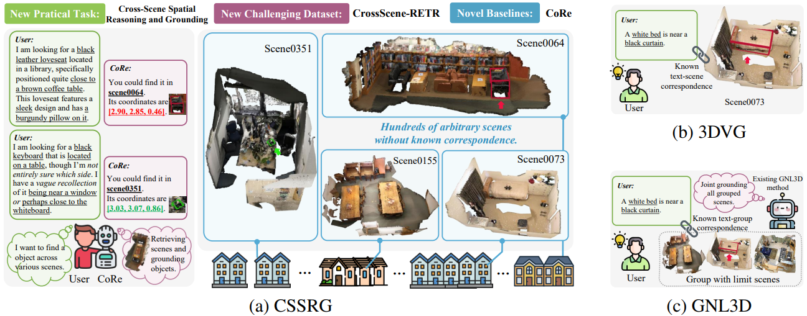
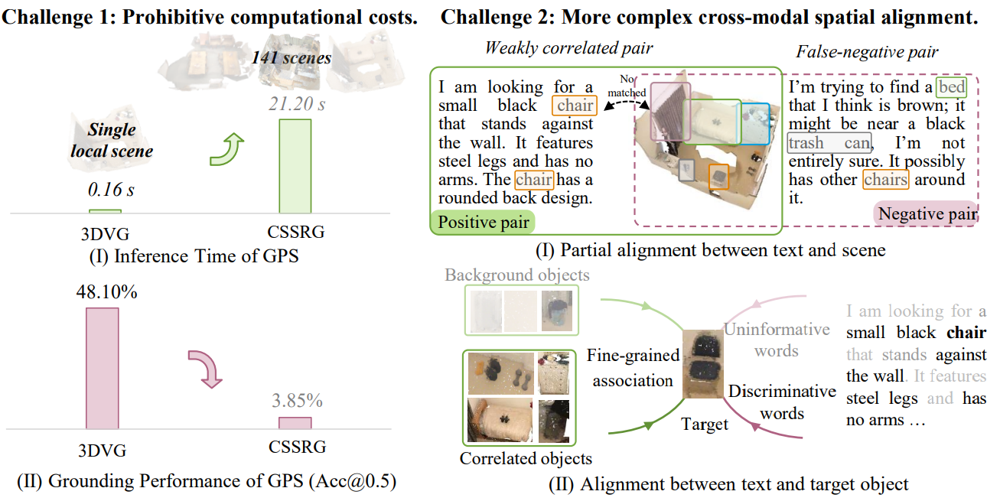
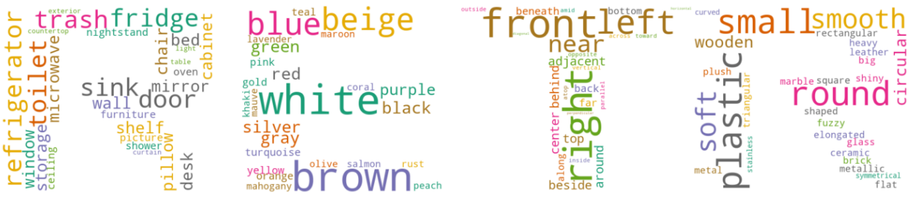
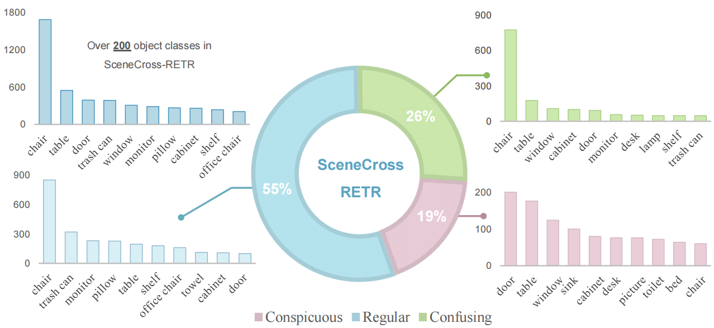
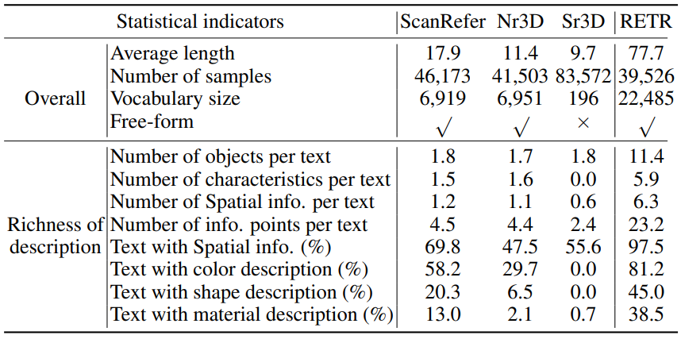
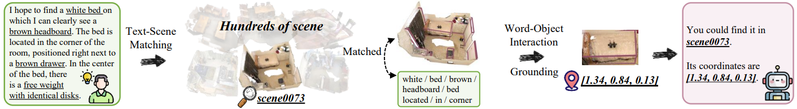
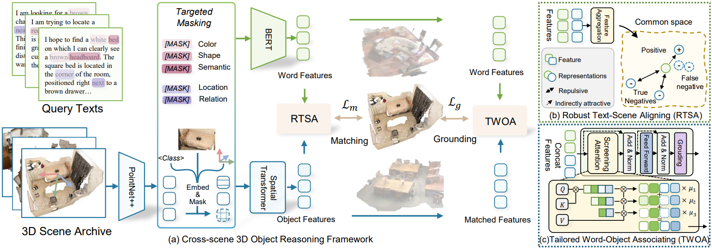

The original implementation version of NeurIPS 2025 paper [**Robust Cross-modal Alignment Learning for Cross-Scene Spatial Reasoning and Grounding**](https://openreview.net/pdf?id=xjC5NqqSHs). 🎉🎉

| [Paper](https://openreview.net/pdf?id=xjC5NqqSHs) | [Dataset](https://drive.google.com/drive/folders/19lox3eRF0EAVjz6TcQDb7Ns9vjI9qkXN?usp=drive_link) | [Baseline](./) |
|-------|----------|-----------|




## Abstract
Grounding target objects in 3D environments via natural language is a fundamental capability for autonomous agents to successfully fulfill user requests. Almost
all existing works typically assume that the target object lies within a known scene and focus solely on in-scene localization. In practice, however, agents often encounter unknown or previously visited environments and need to search across a large archive of scenes to ground the described object, thereby invalidating this assumption. To address this, we reveal a novel task called Cross-Scene Spatial Reasoning and Grounding (CSSRG), which aims to locate a described object anywhere across an entire collection of 3D scenes rather than predetermined scenes. Due to the difference from existing 3D visual grounding, CSSRG poses two challenges: the prohibitive cost of exhaustively traversing all scenes and more complex cross-modal spatial alignment. To address the challenges, we propose a Cross-Scene 3D Object Reasoning Framework (CoRe), which adopts a matching-then-grounding pipeline to reduce computational overhead. Specifically, CoRe consists of i. a Robust Text-Scene Aligning (RTSA) module that learns global scene representations for robust alignment between object descriptions and the corresponding 3D scenes, enabling efficient retrieval of candidate scenes; and ii. a Tailored Word-Object Associating (TWOA) module that establishes fine-grained alignment between words and target objects to filter out redundant context, supporting precise object-level reasoning and alignment. Additionally, to benchmark CSSRG, we construct a new CrossScene-RETR dataset and evaluation protocol tailored for cross-scene grounding. Extensive experiments across four multimodal datasets demonstrate that CoRe dramatically reduces computational overhead while showing superiority in both scene retrieval and object grounding.

## Task 
In this paper, we present a Cross-Scene Spatial Reasoning and Grounding (CSSRG) task. This task involves grounding a 3D object from a scene archive that
relies only on a query description. It presents two major challenges:


## Dataset: CrossScene-RETR 🏠

To comprehensively evaluate performance on the CSSRG task, we introduce a new text dataset, **CrossScene-RETR**, based on the ScanNet 3D scene collection, forming a multimodal dataset suitable for CSSRG. It features more comprehensive and realistic textual descriptions compared with existing 3DVG datasets.


For ease of use, its format is consistent with [ScanRefer](https://daveredrum.github.io/ScanRefer/). **Besides being applied to the CSSRG task, it can also be easily adapted for 3DVG tasks to validate the scalability and real-world applicability of your 3DVG work**. Its data and index files are available on [Google Drive](https://drive.google.com/drive/folders/19lox3eRF0EAVjz6TcQDb7Ns9vjI9qkXN?usp=drive_link). (Please note that the indices for training and validation scenes do not exactly match ScanNet; please use our provided index `.txt` files.)

## Baseline: CORE 💪
Pipeline:

Framework:


## Requirements ⚙️
Following [3D-VisTA](https://github.com/3d-vista/3D-VisTA), we build the conda environment:
1. Install conda package
```bash
conda env create --name core --file=environments.yml
```

Summary of key packages:
- cudatoolkit 11.3
- python 3.8.16
- pytorch 1.12.1
- transformers 4.29.2

2. Install PointNet2
```bash
cd vision/pointnet2
python3 setup.py install
```
If you encounter any environment setup issues, please first refer to the [3D-VisTA issues page](https://github.com/3d-vista/3D-VisTA/issues).

3. Pretrained models
- [Bert](https://huggingface.co/google-bert/bert-base-uncased/tree/main) put into `model\language\bert`
- [PointNet](https://drive.google.com/file/d/1LGANvrUsGhHXOzFz5_XtxCKCaSB-qBje/view?usp=drive_link) put into `model\vision\pretrained`

## Data 
We follow 3D-VisTA for the use of [ScanRefer](https://daveredrum.github.io/ScanRefer/), [Nr3D](https://github.com/referit3d/referit3d) and [Sr3D](https://github.com/referit3d/referit3d) to ensure fair and comprehensive evaluation.
For their data, you can directly download it and place it in the corresponding `/data/scanfamily/annotations` folder. [Here](https://drive.google.com/drive/folders/1qJJlUZZamDzTt5I3-CK2P3X6ZC88Z8NT?usp=drive_link) is the data we preprocessed based on 3D-VisTA.  
(The relevant paths and code will be released soon...)
1. text data:
```
data/scanfamily/annotations/
├── meta_data
│ ├── cat2glove42b.json
│ ├── scannetv2-labels.combined.tsv
│ └── scannetv2_raw_categories.json
├── refer
│ ├── nr3d.jsonl
│ ├── scanrefer.jsonl
│ ├── sr3d.jsonl
│ ├── newest_my_data_val.jsonl
│ └── newest_my_data_train.jsonl 
├── splits
│ ├── ScanRefer_filtered_train.txt
│ ├── ScanRefer_filtered_val.txt
│ ├── nr3d_train.txt
│ ├── nr3d_val.txt
│ ├── sr3d_train.txt
│ ├── sr3d_val.txt
│ ├── scene_id_train.txt
│ └── scene_id_val.txt
```
2. 3D scan data

Follow [Vil3dref](https://github.com/cshizhe/vil3dref?tab=readme-ov-file) and download scannet data under data/scanfamily/scan_data, this folder should look like:
```
./data/scanfamily/scan_data/
├── instance_id_to_gmm_color
├── instance_id_to_loc
├── instance_id_to_name
└── pcd_with_global_alignment
```
3. 3D Mask (Following 3D-VisTA)
You can find the mask data [here](https://drive.google.com/file/d/1w9m3lCW67Tul8qbkES7paX0cFXjblQ-C/view). And put it in:
```
./data/scanfamily/
```
It look like:
```
./data/scanfamily/
├── annotations
├── scan_data 
└── save_mask
```

## Training and Evaluation
To run our CoRe on the proposed CrossScene-RETR dataset, please run the script: `CUDA_VISIBLE_DEVICES=0 python3 run.py --config project/core/cross_scene_config.yml`

If you need to test, update the `load_dir` and `load_name` in `project/core/cross_scene_config.yml` with the training checkpoint path, set `eval_task` and `restore_model` to `True`, and then run the script: `CUDA_VISIBLE_DEVICES=0 python3 run.py --config project/core/cross_scene_config.yml`


## Acknowledge ✍
Our baseline follows the work of [3D-VisTA](https://github.com/3d-vista/3D-VisTA), and the datasets follow the works of 
[ScanNet](https://github.com/ScanNet/ScanNet), 
[ScanRefer](https://daveredrum.github.io/ScanRefer/), 
[ReferIt3D](https://github.com/referit3d/referit3d), and 
[ScanQA](https://github.com/ATR-DBI/ScanQA).  
We thank them for their high-quality open-source contributions.


## Reference 🤗
If this paper is helpful for your research, please cite:
```bibtex
@inproceedings{fengrobust,
  title={Robust Cross-modal Alignment Learning for Cross-Scene Spatial Reasoning and Grounding},
  author={Feng, Yanglin and Zhu, Hongyuan and Peng, Dezhong and Peng, Xi and Song, Xiaomin and Hu, Peng},
  booktitle={The Thirty-ninth Annual Conference on Neural Information Processing Systems}
}
```
Feel free to reach out for discussion or collaboration: fcyzfyl@163.com
